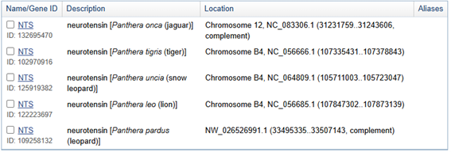
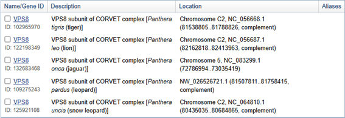
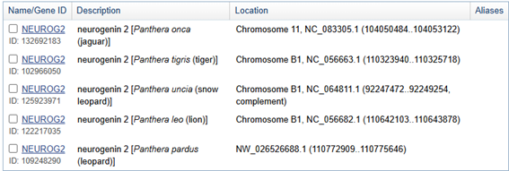
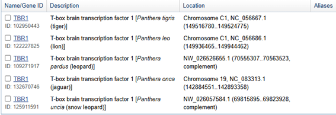
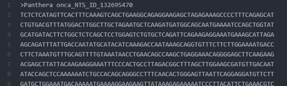

# Genes y cerebro: filogenia de los felinos
Este estudio explora la evolución cerebral del género Panthera mediante análisis filogenéticos de genes relacionados con el desarrollo neurobiológico.
*************** 
## Introducción
La evolución cerebral en felinos permite explorar vínculos entre genética y comportamiento. Se ha sugerido que una mayor encefalización, al implicar más neuronas por unidad de masa, podría reflejar mayor capacidad cognitiva. Dentro del orden Carnivora, los felinos ofrecen un modelo idóneo por su filogenia bien conocida y registro fósil amplio[^1]. Investigaciones recientes han mostrado que la sociabilidad influye en el volumen relativo de la corteza anterior (CA), con leones y guepardos —ambos sociales— mostrando los valores más altos y bajos, respectivamente. Además, se ha identificado dimorfismo sexual en leones, con hembras presentando mayor volumen relativo de CA. Sin embargo, la función exacta de esta región cerebral en felinos sigue siendo poco comprendida y requiere más estudios[^2]. Este proyecto propone reconstruir un árbol filogenético basado en genes asociados al desarrollo cerebral en felinos, con el fin de identificar patrones evolutivos que puedan estar asociados a cambios del encéfalo. Se seleccionarán cuatro genes clave relacionados al desarrollo cerebral cuyas secuencias serán descargadas desde la base de datos NCBI. Estas secuencias serán alineadas usando MUSCLE, y se generarán árboles filogenéticos para cada gen con IQ-TREE. Luego, se generará un árbol consenso mediante ASTRAL editando archivos en Atom si es necesario. Finalmente, el árbol consenso, enriquecido con los gene concordance factors, será graficado en FigTree.

****************
## Programas 
* Iqtree
* Figtree
* Muscle
* Astral
* Atom
* NCBI
**************
## Cómo usar el programa
#### 1. Se escogieron los siguientes genes por estar directamente relacionados al desarrollo cerebral en los mamíferos: 
    * NTS
    * VPS8
    * NEUROG2
    * TBR1
#### 2. El género Panthera cuenta con 5 especies, en esta ocasión trabajaremos con 6 especies pues las otras dos corresponden al género Neofelis el cuál será nuestro grupo externo. Debido a que las descargas de genes desde NCBI se pueden realizar a nivel de especie y no de género se creó el programa **Descargar_genes.sh, que se encuentra adjunto en los documentos de este proyecto.** Este es un archivo ejecutable que contiene lo siguiente:
 
* Especies (5 género Panthera) (1 género Neofelis)

    * Panthera leo
    * Panthera onca
    * Panthera pardus
    * Panthera tigris
    * Panthera uncia
    * Neofelis nebulosa

* GeneID para cada especie (datos extraídos de _NCBI_)
    * NTS  

    * VPS8  

    * NEUROG2  

    * TBR1  
  

#### 3. Debido a que son varias secuencias de genes se creó un archivo ejecutable (adjunto a este repositorio) que consiste en:
 * Nombre del archivo: Descargar_genes.sh  
   $ ./datasets download gene gene-id GeneID 1 GeneID 2 GeneID... GeneID 6 --filename (nombre del grupo).zip

 * Para ejecutar el documento se debe colocar en la terminal:  
   $ bash Descargar_genes.sh

#### 4. Ahora editamos en __Atom__ los genes descargados para conservar el nombre de la especie, del gen y GeneID
 
#### 5. Seguido a esto alineamos nuestras secuencias usando un loop. Es importante contar con __muscle__ en la carpeta donde se encuentren nuestros archivos.  
  $ for genes in *.fna  
   \>do  
   \>./muscle3.8.31_i86linux64 -in "$genes" -out "$genes.fna.aligned.fna" -maxiters 1 -diags  
   \>done  
#### 6. Ya que contamos con nuestras secuencias alineadas podemos crear árboles filogenéticos para cada gen.  
Por lo que usaremos __Iqtree__.  
  $ module load iqtree/2.2.2.6  
Ejecutamos un loop para crear todos los archivos .treefile de los genes alineados.  
  $for genes in muscle_*  
   \>do  
   \>iqtree2 -s $genes  
   \>done  
#### 7. Finalmente crearemos nuestro árbol concenso con __Astral__.  
  $ cat *.treefile > All.Trees.Panthera.tree _(unir los archivos .treefile en un solo archivo .tree)_  
  * Crear variable de ASTRAL  
  $ astral=/_(Ruta del archivo)_/Astral/astral.5.7.8.jar  
  * Usamos nuestra variable astral con el archivo que contiene todos los .treefile para encontrar el árbol concenso:  
  $ java -jar $astral -i All.Trees.Panthera.tree -o Astral.Panthera.tree  
#### 8. Podemos visualizar nuestro árbol filogenético en __FigTree__ donde podemos editarlo y tomar como grupo externo a la especie que escojimos _"Neofelis nebulosa"_.  

 
********************
## Autor
* Katherine Aguirre _Estudiante de Biologìa en la Pontificia Universidad Catòlica del Ecuador_
************
## Referencias

[^1]:Finarelli, John A., y John J. Flynn. 2009. «Brain-size Evolution And Sociality In Carnivora». Proceedings Of The National Academy Of Sciences 106 (23): 9345-49. https://doi.org/10.1073/pnas.0901780106.

[^2]:Sakai, Sharleen T., Bradley M. Arsznov, Ani E. Hristova, Elise J. Yoon, y Barbara L. Lundrigan. 2016. «Big Cat Coalitions: A Comparative Analysis Of Regional Brain Volumes In Felidae». Frontiers In Neuroanatomy 10 (octubre). https://doi.org/10.3389/fnana.2016.00099.

